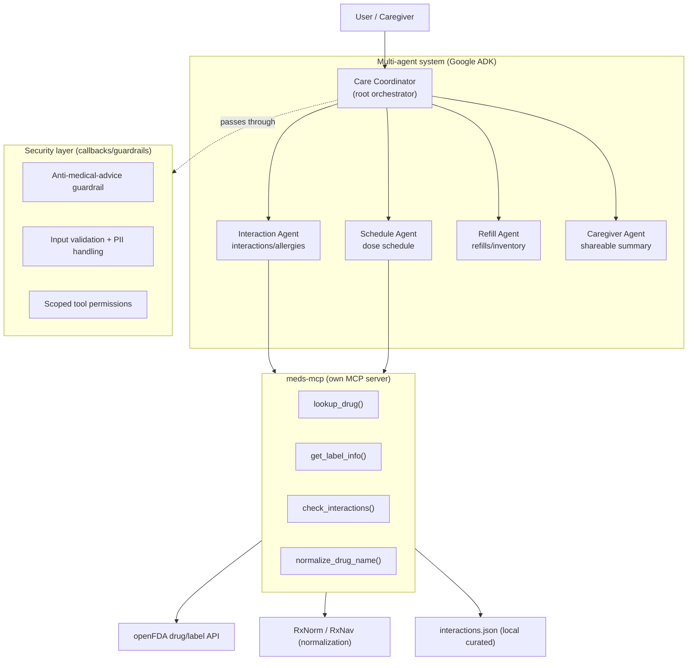

# 💊 MediMate — Secure Multi-Agent Medication Concierge

> A safe, multi-agent concierge that **organizes and explains** a patient's
> medications — schedules, interactions, refills, and caregiver summaries —
> without ever prescribing.

> **Capstone — AI Agents: Intensive Vibe Coding Course (Google × Kaggle)** ·
> Track: **Concierge Agents**

> ⚠️ **Medical disclaimer.** MediMate is an informational tool. It **organizes
> and informs; it never prescribes, diagnoses, or gives medical advice.** Every
> clinical output carries a disclaimer and refers you to a professional. This is
> enforced **in code** (deterministic guardrails), not just in prompts. Always
> consult a qualified doctor or pharmacist.


---

## Problem

People on complex regimens — often older adults — take several medications with
different times, food rules, and dangerous drug-drug interactions. Coordinating
this by hand is error-prone and usually falls on a caregiver:

- **Timing & food rules** are easy to get wrong across 5+ medications.
- **Interactions** between drugs can be serious (e.g. *warfarin + aspirin*) and
  are hard for a layperson to spot.
- **Refills** run out unnoticed.
- **Handoffs** to a doctor or caregiver require a clear, current summary.

The hard constraint: a consumer tool in this space **must not** drift into
prescribing or diagnosing. Safety has to be structural, not a polite request to
the model.

## Solution

MediMate is a multi-agent system built with **Google ADK**. A root *Care
Coordinator* understands the request and **delegates** to one of four specialist
sub-agents. Clinical data comes from **our own MCP server** (`meds-mcp`) that
wraps public sources (openFDA, RxNorm) plus a curated local interaction base. A
**deterministic security layer** (ADK callbacks) intercepts any request for
prescribing/diagnosing and guarantees a disclaimer on clinical output.

## Architecture

A root orchestrator delegates to four specialists; clinical tools are served by
our own MCP server; a security layer wraps every model and tool call.



**Root orchestrator — Care Coordinator** (`medimate/agent.py`). Holds the thread
and routes each request to the right specialist via the sub-agent's
`description` (real delegation, not keyword routing). It also has profile tools
for simple lookups.

**Four specialist sub-agents** (`medimate/sub_agents/`):
- **Schedule Agent** — builds the daily dose plan (times, with/without food),
  consulting the FDA label via MCP for administration notes.
- **Interaction Agent** — calls `check_interactions` on the MCP server, then
  loads the `interaction_report` skill to write a safe, structured report.
- **Refill Agent** — computes days remaining (`inventory_pills / pills_per_day`)
  and drafts refill reminders; can update inventory.
- **Caregiver Agent** — loads the `caregiver_handoff` skill to produce a
  shareable summary for a clinician.

**Own MCP server — `meds-mcp`** (`meds_mcp/server.py`). A FastMCP server (stdio)
exposing four tools: `lookup_drug`, `get_label_info`, `check_interactions`,
`normalize_drug_name`. The agent consumes it through ADK's `McpToolset`, which
launches `python -m meds_mcp.server` as a subprocess.


## Course concepts demonstrated

| Concept | Where it lives |
|---|---|
| **Multi-agent system (ADK)** | `medimate/agent.py` (root) + `medimate/sub_agents/` (4 specialists) |
| **Own MCP server** | `meds_mcp/server.py` (FastMCP, 4 tools) consumed via `medimate/tools/mcp_tools.py` |
| **Agent Skills** (progressive disclosure) | `medimate/skills/*/SKILL.md` + loader `medimate/tools/skill_tools.py` |
| **Security / guardrails** | `medimate/security/guardrails.py` (ADK callbacks) + `medimate/security/pii.py` |
| **Deployability** | `deployment/deploy_agent_engine.py` + `deployment/README.md` (Vertex AI Agent Engine) |
| **Antigravity** | Built in the Google Antigravity IDE (shown in the demo video) |

## Project structure

```
MediMate/
├── README.md                      # this file
├── BUILD_PLAN.md                  # phase-by-phase build plan
├── CLAUDE.md                      # project contract / rules
├── requirements.txt
├── .env.example                   # env template (no secrets)
├── .gitignore
├── docs/
│   └── architecture.md            # architecture + mermaid diagram
├── meds_mcp/                      # own MCP server
│   ├── server.py                  # FastMCP + 4 tools
│   ├── openfda_client.py          # openFDA client (httpx)
│   ├── rxnorm_client.py           # RxNorm name normalization
│   ├── interactions.py            # curated base load + pair matching
│   └── data/interactions.json     # curated interaction base
├── medimate/                      # ADK multi-agent system
│   ├── agent.py                   # root_agent = Care Coordinator
│   ├── config.py                  # model + .env loading
│   ├── prompts.py                 # agent instructions
│   ├── sub_agents/                # 4 specialist agents
│   ├── tools/                     # mcp_tools, profile_tools, skill_tools
│   ├── security/                  # guardrails + PII redaction
│   ├── skills/                    # interaction_report, caregiver_handoff
│   └── data/profiles/example_profile.json
├── eval/                          # tests + ADK evalset
│   ├── test_agents.py
│   └── medimate.evalset.json
├── ui/app.py                      # Gradio demo (chat + dashboard)
└── deployment/                    # Agent Engine deploy script + docs
```

## Setup & run

Requires **Python 3.10+**.

```bash
# 1. From the repo root, create and activate a virtual environment
python -m venv .venv
source .venv/bin/activate            # Windows: .venv\Scripts\activate

# 2. Install dependencies
pip install -r requirements.txt

# 3. Create your .env from the template and fill in your key
cp .env.example .env                 # Windows: copy .env.example .env
#   then edit .env and set GOOGLE_API_KEY=...  (Google AI Studio)
```

**Test the MCP server** with the official MCP Inspector (opens a web UI):

```bash
npx @modelcontextprotocol/inspector python -m meds_mcp.server
# In the UI: Tools -> check_interactions
#   drugs = ["warfarin","aspirin","simvastatin","clarithromycin"]
#   -> returns 2 major interactions
```

**Run the agent UIs:**

```bash
adk web medimate          # ADK dev UI (shows delegation traces)
python ui/app.py          # Gradio demo (chat + patient dashboard) -> http://127.0.0.1:7860
```

**Run the tests / evals:**

```bash
pytest eval/              # 12 tests: MCP, known interaction, adversarial guardrail, PII
```

> On the test machine, `pytest eval/` reports **12 passed**, and
> `check_interactions(["warfarin","aspirin","simvastatin","clarithromycin"])`
> returns the two expected *major* interactions (warfarin+aspirin,
> simvastatin+clarithromycin).


## Security

Safety is enforced in code, not just prompts — this is MediMate's core "security
features" demonstration.

- **Deterministic guardrails** (`medimate/security/guardrails.py`), wired into
  the root agent and all sub-agents as ADK callbacks:
  - `before_model_callback` — if the user asks for prescribing/diagnosing
    (e.g. *"what extra dose can he take?"*, *"what do I have?"*), it **refuses
    and refers to a professional without ever calling the model**.
  - `after_model_callback` — softens imperative clinical phrasing into
    informational language and **ensures the disclaimer is present**.
  - `before_tool_callback` — sanitizes tool arguments (trim + size limits) and
    enforces a **read-only policy**: only `update_inventory` may write.
- **No secrets in the repo.** All keys come from `.env` (git-ignored); only
  `.env.example` is versioned.
- **Health PII never committed.** Real profiles live in
  `medimate/data/profiles/*.json` (git-ignored); only `example_profile.json` is
  versioned. `medimate/security/pii.py` redacts emails, phone numbers, dates,
  and known profile names from logs.

## Data sources & attribution

MediMate uses only public, no-cost sources. Clinical claims come from these
sources, never invented by the model:

- **openFDA — `drug/label.json`** (U.S. FDA, public domain). Official label text
  for interactions, contraindications, and boxed warnings.
  <https://open.fda.gov/apis/drug/label/>
- **RxNorm / RxNav** (U.S. National Library of Medicine). Used **only for drug
  name normalization** (`rxcui`). Note: RxNav's drug-interaction API was
  **discontinued in January 2024**, which is why the interaction pipeline is our
  own. <https://lhncbc.nlm.nih.gov/RxNav/>
- **Curated local interaction base** (`meds_mcp/data/interactions.json`) — a
  small, high-severity drug-drug interaction set for educational use, compiled
  from: U.S. FDA prescribing information (openFDA drug/label); an ONC-style
  high-priority interaction list (expert panel, public domain); and CredibleMeds
  (QT prolongation / Torsades de Pointes risk).

---

_Educational project. Not a medical device. MediMate organizes and informs; it
never prescribes or diagnoses._
